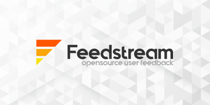

# Feedstream

<a id="readme-top"></a>

<!-- PROJECT LOGO -->
<br />
<div align="center">
  <a href="https://github.com/matthewenderle/feedstream">
    
  </a>

<h3 align="center">Feedstream</h3>

  <p align="center">
    Feedstream is a self-hostable User Feedback application designed to collect data from your users. It is tailored to provide a destination for Feature Requests and Bug Reports from your users. It also includes a Roadmap, which enables you to show your users what features are coming, and when. You can also use the Changelog to show them what recent modifications were made.
    </p>
    <p>
    Users can also vote on feature requests and bug reports to emphasise how often or important a particular feature is to them.
    <br />
    <a href="https://github.com/matthewenderle/feedstream"><strong>Explore the docs »</strong></a>
    <br />
    <br />
    <a href="https://feedstream.enderle.io">View Demo</a>
    ·
    <a href="https://github.com/matthewenderle/feedstream/issues/new?labels=bug&template=bug-report---.md">Report Bug</a>
    ·
    <a href="https://github.com/matthewenderle/feedstream/issues/new?labels=enhancement&template=feature-request---.md">Request Feature</a>
  </p>
</div>

<!-- TABLE OF CONTENTS -->
<details>
  <summary>Table of Contents</summary>
  <ol>
    <li>
      <a href="#about-the-project">About The Project</a>
      <ul>
        <li><a href="#built-with">Built With</a></li>
      </ul>
    </li>
    <li>
      <a href="#getting-started">Getting Started</a>
      <ul>
        <li><a href="#prerequisites">Prerequisites</a></li>
        <li><a href="#installation">Installation</a></li>
      </ul>
    </li>
    <li><a href="#usage">Usage</a></li>
      <ul>
        <li><a href="#authentication">Authentication Handling</a></li>
      </ul>
    <li><a href="#license">License</a></li>
  </ol>
</details>

<!-- ABOUT THE PROJECT -->

## About The Project

This project is still under-development at this time.
I started building this application because I wanted a better way to track user feedback. I didn't like my Discord setup as it got unorganized rather quickly. I also didn't want to pay for a subscription service when I could build and host one myself.

<p align="right">(<a href="#readme-top">back to top</a>)</p>

### Built With

- [![Nuxt][Nuxt.js]][Nuxt-url]
- [![Vue][Vue.js]][Vue-url]
- [![Supabase][Supabase]][Supabase-url]

<p align="right">(<a href="#readme-top">back to top</a>)</p>

<!-- GETTING STARTED -->

## Getting Started

This is an example of how you may give instructions on setting up your project locally.
To get a local copy up and running follow these simple example steps.

### Prerequisites

This is an example of how to list things you need to use the software and how to install them.

- pnpm
  ```sh
  pnpm install npm@latest -g
  ```

### Create a HTTPS self-signed cert for development

I had an issue where a public wifi didn't allow another developer to connect, so I created a simple script that can be ran which will create the certs.

- pnpm

  ```sh
  pnpm run gererateCerts

  pnpm run dev-https
  ```

### Installation

1. Get a free API Key at [https://example.com](https://example.com)
2. Clone the repo
   ```sh
   git clone https://github.com/matthewenderle/feedstream.git
   ```
3. Install NPM packages
   ```sh
   npm install
   ```
4. Enter your API in `config.js`
   ```js
   const API_KEY = 'ENTER YOUR API';
   ```
5. Change git remote url to avoid accidental pushes to base project
   ```sh
   git remote set-url origin matthewenderle/feedstream
   git remote -v # confirm the changes
   ```

<p align="right">(<a href="#readme-top">back to top</a>)</p>

<!-- USAGE EXAMPLES -->

## Usage

Use this space to show useful examples of how a project can be used. Additional screenshots, code examples and demos work well in this space. You may also link to more resources.

_For more examples, please refer to the [Documentation](https://example.com)_

### Authentication

Authentication is handled with Supabase and the useAuthentication composable. Users can be defined as Administrators using the `raw_user_meta_data` column in the `auth.users` table. Add a new key to the JSON object `"userLevel":1` and then you can check if the user is an admin with the `useAuthentication().isAdmin`.

For Middleware control, we use `useAuthentication().isTokenActive` which checks the JWT and ensures it's not expired. This is better than doing `supabase.auth.getUser()` as it doesn't hit the SB API every request. Once the token is verified and the page is loaded, then we can get the user data if needed.

<p align="right">(<a href="#readme-top">back to top</a>)</p>

### Top contributors:

<a href="https://github.com/Matthewenderle/feedstream/graphs/contributors">
  
</a>

<!-- LICENSE -->

## License

Distributed under the project_license. See `LICENSE.txt` for more information.

<p align="right">(<a href="#readme-top">back to top</a>)</p>

<!-- MARKDOWN LINKS & IMAGES -->
<!-- https://www.markdownguide.org/basic-syntax/#reference-style-links -->

[contributors-shield]: https://img.shields.io/github/contributors/matthewenderle/feedstream.svg?style=for-the-badge
[contributors-url]: https://github.com/matthewenderle/feedstream/graphs/contributors
[forks-shield]: https://img.shields.io/github/forks/matthewenderle/feedstream.svg?style=for-the-badge
[forks-url]: https://github.com/matthewenderle/feedstream/network/members
[stars-shield]: https://img.shields.io/github/stars/matthewenderle/feedstream.svg?style=for-the-badge
[stars-url]: https://github.com/matthewenderle/feedstream/stargazers
[issues-shield]: https://img.shields.io/github/issues/matthewenderle/nuxt3-saas-boilerplate.svg?style=for-the-badge
[issues-url]: https://github.com/matthewenderle/nuxt3-saas-boilerplate/issues
[license-shield]: https://img.shields.io/github/license/matthewenderle/nuxt3-saas-boilerplate.svg?style=for-the-badge
[license-url]: https://github.com/matthewenderle/nuxt3-saas-boilerplate/blob/master/LICENSE.txt
[product-screenshot]: images/screenshot.png
[Nuxt.js]: https://img.shields.io/badge/nuxt.js-000000?style=for-the-badge&logo=nuxtdotjs&logoColor=white
[Nuxt-url]: https://nuxtjs.org/
[Supabase]: https://img.shields.io/badge/Supabase-000000?style=for-the-badge&logo=supabase&logoColor=3FCF8E
[Supabase-url]: https://supabase.com/
[Vue.js]: https://img.shields.io/badge/Vue.js-35495E?style=for-the-badge&logo=vuedotjs&logoColor=4FC08D
[Vue-url]: https://vuejs.org/
